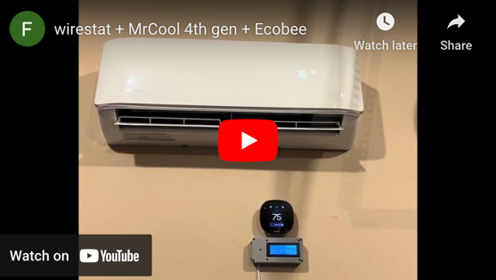

# wirestat

## What is it?

wirestat is a compact gadget that bridges the gap between traditional wired household thermostats and ductless mini split
systems. With wirestat, you can control your mini split using familiar thermostats, whether it's an old-school thermostat
like Honeywell or a smart thermostat like Nest or Ecobee.

Why did I create wirestat?

- I wanted a consistent thermostat experience for my central AC and mini splits.
- I prefer traditional thermostats to smartphone apps and remote controls.
- I was frustrated by the lack of precise control over temperature swings and other settings.
- Ultimately, I wished I could use a regular household thermostat for my mini split.

## What is it not?

wirestat is not another smart thermostat. It is actually pretty dumb: 
- No buttons.
- No app.
- No internet.

## Is it for sale?

At this point in time, wirestat is a DIY project: All parts have to be sourced and assembled
yourself. I might create and sell a small batch at cost some time in the future. Please get in
touch with me if you would like a copy.

## How does it work?

wirestat continuously monitors your thermostat. When it detects a call (e.g., a call for cooling), it relays the command
to your mini split's indoor unit (IDU) via an infrared signal.

Examples:
- Thermostat calls for Stage 1 Cooling -> send "Cool / 70 Degree / Fan Low" to IDU
- Thermostat calls for Stage 2 Cooling -> send "Cool / 70 Degree / Fan Auto" to IDU
- Thermostat calls for Fan => send "Fan Auto" to IDU

## Media

### Configuration

wirestat supports the following inputs:

| Symbol | Descr             |
|--------|-------------------|
| G1     | Fan (stage 1)     |
| G2     | Fan (stage 2)     |
| G3     | Fan (stage 3)     |
| Y1     | Cooling (stage 1) |
| Y2     | Cooling (stage 2) |
| W1     | Heating (stage 1) |
| W2     | Heating (stage 2) |

It's fine if you thermostat does not support all of the above inputs. If you thermostat only supports a single stage for
fan, cooling and heating, you only need to wire G1, Y1 and W1.

Each relevant input scenario is mapped to an infrared signal for the IDU.

Example:

| G1  | G2  | G3  | Y1  | Y2  | W1  | W2  | Infrared Signal for IDU |
|-----|-----|-----|-----|-----|-----|-----|-------------------------|
| 0   | 0   | 0   | 0   | 0   | 0   | 0   | OFF                     |
| 1   | 0   | 0   | 0   | 0   | 0   | 0   | Fan (low)               |
| ... | ... | ... | ... | ... | ... | ... | ...                     |
| 0/1 | 0/1 | 0/1 | 1   | 0   | 0   | 0   | Cool (72F) / Fan (low)  |
| 0/1 | 0/1 | 0/1 | 0   | 1   | 0   | 0   | Cool (72F) / Fan (high) |
| ... | ... | ... | ... | ... | ... | ... | ...                     |

# Resources

## :warning: Warning :warning:

wirestat is an experimental hobby project. I've put it together without a background in electrical engineering - use the
provided circuit, firmware and enclosure at your own risk.

## Firmware

The firmware was developed using the [Arduino IDE](https://www.arduino.cc/en/software).

Source: [wirestat.ino](firmware/wirestat/wirestat.ino)

## Schematics

The schematics were drawn in [KiCad](https://www.kicad.org). 

Source: [wirestat.kicad_sch](schematics/wirestat.kicad_sch)

## Enclosure

The enclosure was designed in [Blender](https://www.blender.org) and printed on a
[Bambu Lab X1 Carbon](https://bambulab.com/en-us/x1) 3D printer.

Blender file:
- [enclosure.blend](enclosure/enclosure.blend)

STL exports:
- [base.stl](enclosure/base.stl)
- [lid.stl](enclosure/lid.stl)
- [thermostat-cover-plate.stl](enclosure/thermostat-cover-plate.stl)

## Power Supply

wirestat operates on a 24V AC input, making it fully compatible with the standard power supply used by regular household
thermostats.

You have two options to power wirestat:

- Utilize the existing power supply of your thermostat, or
- Purchase an [AC 24 Volt Transformer](https://www.amazon.com/dp/B07DJ7RHS5) to power both wirestat and your thermostat.

## Parts List

I've sources some components (e.g., the transistor and infrared LED) from existing boards and Arduino starter kits. 
Accordingly, I do not have a datasheet for those components.  

| Symbol | Confirmed          | Description                                                                                                                | Count | Unit Price | Total  |
|--------|--------------------|----------------------------------------------------------------------------------------------------------------------------|-------|------------|--------|
| U1     | :white_check_mark: | [ESP32 Development Board](https://www.amazon.com/gp/product/B0718T232Z)                                                    | 1                                                                                                                          | $9.99      | $9.99  |
| U2-U8  | :white_check_mark: | [SFH620AGB Optoinsulator](https://www.digikey.com/en/products/detail/vishay-semiconductor-opto-division/SFH620AGB/4074947) | 7                                                                        | n/a        | $4.22  |
| R1     | :white_check_mark: | [10 kΩ Resistor](https://www.digikey.com/en/products/detail/yageo/MF0207FRE52-10K/9124672)                                 | 1                                                                                                                          | $0.10      | $0.10  |
| Q1     | :grey_question:    | [2N3904 NPN Transistor](https://www.digikey.com/en/products/detail/diotec-semiconductor/2N3904/13164701)                   | 1                                                                                                                          | $0.13      | $0.13  |
| D2     | :grey_question:    | [IR LED 940NM](https://www.digikey.com/en/products/detail/lumex-opto-components-inc/OED-EL-1L2/270797)                     | 1                                                                                                                          | $0.58      | $0.58  |
| PS1    | :white_check_mark: | [AC to DC Buck Step Down Converter](https://www.amazon.com/dp/B0983GW7YJ)                                                  | 1                                                                                                                          | n/a        | $8.99  |
| PS1    | :white_check_mark: | [20x4 I2C LCD Module](https://www.amazon.com/dp/B01GPUMP9C)                                                                | 1                                                                                                                          | $12.99     | $12.99 |

# Reverse engineering of infrared commands

I used [IRrecvDumpV2](https://github.com/crankyoldgit/IRremoteESP8266/blob/master/examples/IRrecvDumpV2/IRrecvDumpV2.ino)
to reverse engineer the infrared commands for my indoor unit.

# Open Questions

## Resistors for the infrared LED

Based on my little bit of research, it is required to include the following resistors:

- A ~220Ω resistor between GPIO 5 and the transistor's base.
- A ~22Ω resistor between +3.3V and the infrared LED's anode.

However, the circuit suggested in the [IR Sending](https://github.com/crankyoldgit/IRremoteESP8266/wiki#ir-sending) 
guide connects the transistor and infrared LED directly to the pins of the NodeMCU board:

The circuit operates effectively without resistors, and their absence notably extends the LED's range. I conducted a 
24-hour stress test, during which the circuit continuously transmitted infrared signals. Both the transistor and the LED
performed reliably throughout. Therefore, I've decided to proceed with the sub-circuit without resistors for now.

# References

- [Detecting 24V AC with an ESP32](https://www.youtube.com/watch?v=C4kNbcueWMxM)
- [IR Sending](https://github.com/crankyoldgit/IRremoteESP8266/wiki#ir-sending)

# Contributions

Contributions are always welcome! You can either

- submit a pull request,
- create an issue in GitHub's issue tracker or
- reach out via email at ${firstname}.${lastname}@gmail.com (replacement of placeholders left as exercise to the reader).

I would love to hear from you.